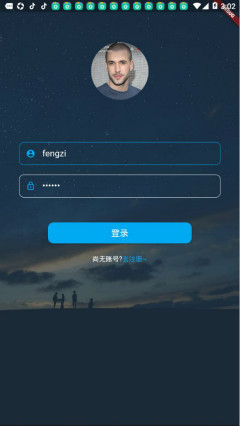
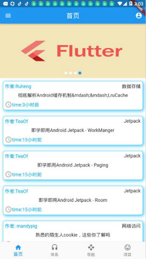
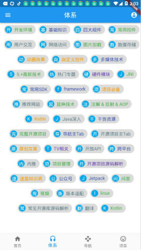
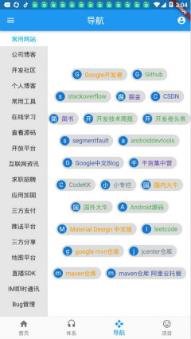
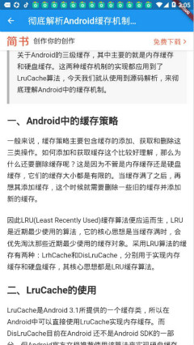

# firstflutter

Flutter与Dart学习的第一个项目(WanAndroid项目)
所有数据和接口都来自:[WanAndroid](https://www.wanandroid.com/index)
debug和release的包下载太慢 已经删除，建议自己编译 测试账户 userName：fengzi; pwd:123456

## 项目截图

## 用到的pub库

* 网络请求:[dio](https://pub.flutter-io.cn/packages/dio)
* 数据存储:[shared_preferences](https://pub.flutter-io.cn/packages/shared_preferences)
* 屏幕适配:[flutter_screenutil](https://pub.flutter-io.cn/packages/flutter_screenutil)
* WebView:[flutter_webview_plugin](https://pub.flutter-io.cn/packages/flutter_webview_plugin)
* 轮播图:[flutter_swiper](https://pub.flutter-io.cn/packages/flutter_swiper)
* 吐司:[fluttertoast](https://pub.flutter-io.cn/packages/fluttertoast)

## apk下载

* [release.apk](https://raw.githubusercontent.com/bikeming/firstFlutter/master/sapk/app-release.apk)
* [debug.apk](https://raw.githubusercontent.com/bikeming/firstFlutter/master/sapk/app-debug.apk)

## Flutter 学习(推荐)

* Flutter中文网:[Flutter中文网](https://flutterchina.club/)
* Dart语言:[Dart语言](http://dart.goodev.org/guides/language/language-tour)
* pub.dev:[pub.dev](https://pub.flutter-io.cn/)
* 基础视频教学(技术胖的):[视频地址](https://www.bilibili.com/video/av35800108/?p=1)

This project is a starting point for a Flutter application.

A few resources to get you started if this is your first Flutter project:

- [Lab: Write your first Flutter app](https://flutter.io/docs/get-started/codelab)
- [Cookbook: Useful Flutter samples](https://flutter.io/docs/cookbook)

For help getting started with Flutter, view our 
[online documentation](https://flutter.io/docs), which offers tutorials, 
samples, guidance on mobile development, and a full API reference.
